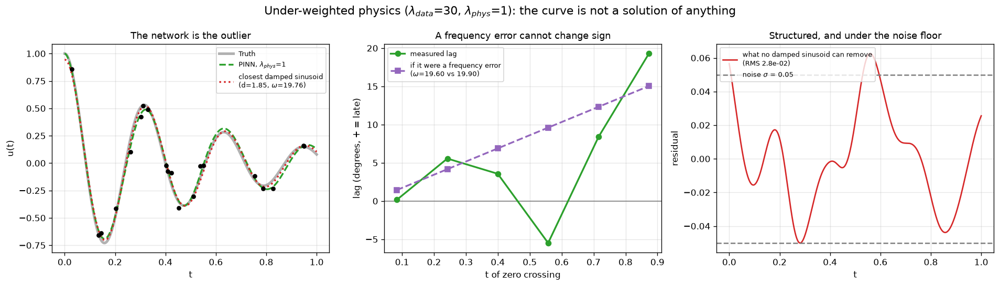

# PINN on a damped oscillator

The code, numbers and figures behind my write-up on physics-informed neural
networks: **<https://christophercrowley.com/project-pinn.html>**

A physics-informed neural network (PINN) is trained on a differential equation
instead of on examples of its solution. Pointed at a damped harmonic
oscillator, where every right answer is known, it recovers the coefficients
more accurately than a classical least-squares fit on the same data, while
drawing a curve that is not a solution of the equation it just recovered.
Nothing the method reports from the inside flags it. The write-up makes that
argument; this repository holds everything needed to check it.



## The problem

Every script solves, fits, or identifies

```
u'' + mu*u' + k*u = 0,    u(0) = 1,  u'(0) = 0
```

with `d = 2` and `omega_0 = 20`, so `mu = 2d = 4` and `k = omega_0^2 = 400`:
about three and a sixth oscillations over `t` in `[0, 1]`, decaying to an
eighth of the starting amplitude. The reference solution everywhere is
fourth-order Runge–Kutta at `dt = 1e-4`. It generates the synthetic
measurements, and it grades every result.

The forward solve, data assimilation, and parameter discovery are not three
algorithms. They are one cost function with terms switched on and off:

| Case | data weight | physics weight | mu, k |
|---|---|---|---|
| 1. Forward solve | 0 | > 0 | known, fixed |
| 2. Data assimilation | > 0 | > 0 | known, fixed |
| 3. Inverse / discovery | > 0 | > 0 | **unknown, trainable** |

## The scripts

Each script is self-contained. Between them they write every figure the
write-up shows and JSON files holding the numbers it quotes, and all of those
are committed here, so a number can be checked without running anything.

| Script | What it runs | Writes |
|---|---|---|
| `pinn_playground.py` | Case 1, the forward solver. Every knob (physics, architecture, optimizer, hard constraint) lives in a config block at the top, with named presets for the interesting failures. Set `activation="relu"` and watch it fail; set `hard_constraint=False` with a small IC penalty and watch it collapse to zero. | `pinn_playground_result.png`, `pinn_playground.json` |
| `pinn_data_inverse.py` | Case 2: fifteen noisy points with a gap, the PINN against a free-form network and a known-form least-squares fit. Then a first inverse problem with `mu` unknown and `k` fixed. | `pinn_data_inverse_result.png`, `pinn_data_inverse.json`, `pinn_data_inverse_demo2.json` |
| `case2_weight_study.py` | The physics-weight sweep Case 2 should have had in the first place, with the weights a person could choose without an answer key marked separately from the one graded against it. | `case2_weight_study_result.png`, `case2_weight_study.json` |
| `case2_weight_seeds.py` | The same weights across five seeds, since the good setting turns out to sit next to a cliff whose location moves. | `case2_weight_seeds.json` |
| `case2_kscale_study.py` | The same sweep with the residual divided by 100, 200, 400, and 300 as a control, to find out whether the best weight belongs to the problem or to the constant. | `case2_kscale_study_result.png`, `case2_kscale_study.json` |
| `pinn_inverse_focused.py` | Case 3: both coefficients unknown, the PINN against classical least squares on identical data and identical prior knowledge. | `pinn_inverse_focused_result.png`, `pinn_inverse_focused.json` |
| `slippage_weight_experiment.py` | The Case 3 physics-weight sweep. Does leaning harder on the physics kill the phase slip? | `slippage_weight_result.png`, `slippage_weight_experiment.json` |
| `slip_diagnostics.py` | The zero-crossing lags, the closest-sinusoid fit, the envelope-normalized errors, and the drift from the recovered equation: everything in the two parts of the write-up that argue hardest. | `slip_diagnostics_result.png`, `bestcase_diagnostics_result.png`, `slip_diagnostics.json` |
| `determinism_check.py` | Fingerprints the data and the initial weights on every repeat, then trains the same configuration several times on CPU, on GPU, and on GPU with deterministic kernels forced. Written to find out whether run-to-run scatter was a bug. | a report in the terminal |
| `warm_start.py` | Called by every study script before its first measured training. See [Reproducibility](#reproducibility). | |

`slip_diagnostics.py` and `determinism_check.py` exist because of questions I
could not answer. The phase-slip and best-case diagnostics were worked out by
hand the first time and never folded back into code, which meant the two parts
of the write-up carrying the most weight were the two nobody could check,
including me. Writing them up as a script confirmed most of what was there and
caught one thing that was backwards: the frequency-error row of the lag table
had the wrong sign, predicting an early arrival for a network that runs slow.
The argument was right and the number contradicting it was wrong, which is the
more embarrassing way round. Re-running everything warm, on a finer grid of
weights, caught two more: the free-form network's training loss had been
reported as `1e-11` when it is `1e-3`, and the half-decade grid had hidden that
equal weights is not the best setting.

## Reproducibility

The published numbers come from PyTorch 2.5.1 with CUDA 12.1 and NumPy 2.4.6,
under Python 3.12, on a 4 GB NVIDIA T400 (a Turing card). Other versions, other
GPUs, and CPUs give slightly different numbers. Near a collapse, where rounding
can decide which way a run goes, the differences can be large.

Two things make one run comparable with another.

**Every residual is divided by the same constant, `K_SCALE = 100`.** The
constant gets squared into the physics weight (only `lambda_phys / K_SCALE^2`
ever reaches the optimizer), so a weight means nothing until you say what the
residual was divided by. The first version of this study divided by a
different constant in one script, and that turned out to be most of the story
of Case 2. `case2_kscale_study.py` shows why.

**Every script calls `warm_start()` before its first measured training.** On a
GPU, the first training in a process takes a different arithmetic route from
every training after it: the first pass happens before cuBLAS holds a handle.
That is not a rounding curiosity. At equal weights in Case 2 it moves the
solution error by almost two percent. `warm_start()` runs a few optimizer steps
on a throwaway network and then restores the random-number state, so repeated
runs are bit-identical. On a CPU it does nothing.

## Running it

Python 3.12 with PyTorch, NumPy, and Matplotlib. Everything runs on a
laptop-class GPU, and falls back to the CPU on its own when there is no CUDA
device.

```
pip install numpy matplotlib
pip install torch --index-url https://download.pytorch.org/whl/cu121
```

Pin `torch==2.5.1+cu121` and `numpy==2.4.6` only if you want the published
digits. Install torch from the PyTorch index alone: give pip a fallback to PyPI
and it will quietly hand you the CPU wheel instead.

Most scripts take no arguments and write into the current directory:

```
python pinn_playground.py
python pinn_data_inverse.py
python case2_weight_study.py          # --quick for a short smoke-test schedule
python pinn_inverse_focused.py
python slippage_weight_experiment.py
python slip_diagnostics.py
```

The two long sweeps can be split across processes:

```
# five seeds, one process each, then combined into case2_weight_seeds.json
python case2_weight_seeds.py --seeds 1 --out s1.json
python case2_weight_seeds.py --seeds 2 --out s2.json
python case2_weight_seeds.py --seeds 3 --out s3.json
python case2_weight_seeds.py --seeds 4 --out s4.json
python case2_weight_seeds.py --seeds 5 --out s5.json
python case2_weight_seeds.py --merge s1.json s2.json s3.json s4.json s5.json

# one process per constant, then combined and drawn
python case2_kscale_study.py --k 100 --out-dir kscale
python case2_kscale_study.py --k 200 --out-dir kscale
python case2_kscale_study.py --k 400 --out-dir kscale
python case2_kscale_study.py --k 300 --out-dir kscale
python case2_kscale_study.py --plot --out-dir kscale
```

`python case2_weight_seeds.py` on its own runs all five seeds in one process.

And the cold start, then the warm start that removes it:

```
python determinism_check.py --mode cuda --configs 20            # first run cold, repeats warm
python determinism_check.py --mode cuda --configs 20 --warmup   # warm throughout
python determinism_check.py --mode cpu
```

Then change one thing and run it again.
